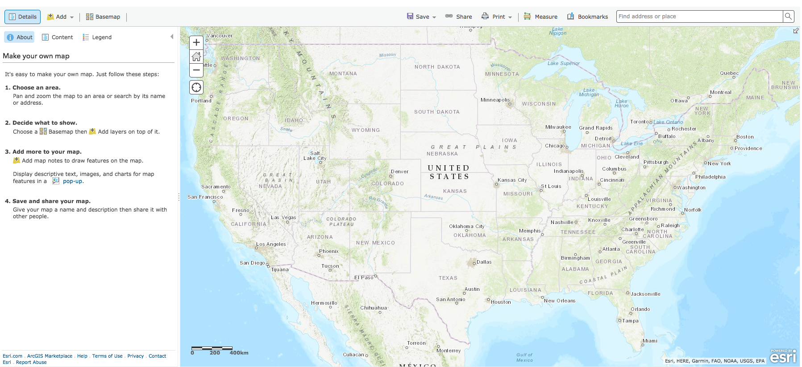
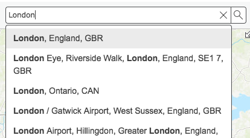
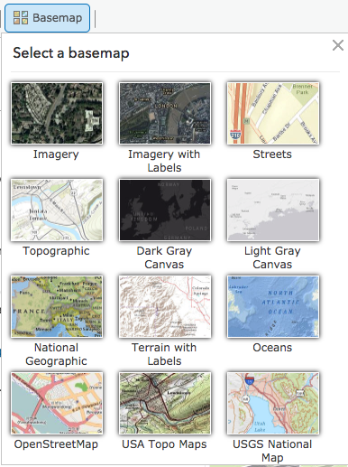

## About
Last Updated 2018-04-06  
Created by Sarah Clayton

## Table of Contents
* [Introduction](#introduction)
* [Logging Into ArcGIS Online](#logging-into-arcgis-online)
* [Preparing the Map](#preparing-the-map)
  * [Repositioning the map](#repositioning-the-map)
  * [Changing the basemap](#changing-the-basemap)
  * 

## Introduction
ArcGIS is a geographic information system (GIS) software. It is one of the most popular and widely used platform for many industries. This workshop will guide you through creating a map with ArcGIS online. We will be using a free public account to create our map. There are more features with the paid version. 

This tutorial will focus on a map of modern London. It was created for Religion in Modern Europe offered Spring 2018 taught by Sarah Griswold. We will go through creating a map, adding data from the ArcGIS platform, loading a CSV, and creating a data layer in the platform. We will then cover how to create a Story Map using the newly created map. 
[Return to Top](#about)

## Logging In
The first step is logging in to the ArcGIS Online platform. Go to [arcgis.com](https://arcgis.com). Click the **Sign In** button on the top right. If you already have any account, you can sign in with your username and password. You can also sign in through your Facebook or Google account. You can also create a new ArcGIS Public account selecting **Create A Public Account**. 

 

After you have signed in, you will be returned to the ArcGIS online home page. 

[Return to Top](#about)
## Preparing the Map
To create a new map, select **Map** from the top tool bar. You will be automatically directed to a the map creation interface.  

*Note: To launch a previously saved map, you will need to select __Content__ from the toolbar.* 

On this screen you should see a map of the United States on the main panel and a side panel with instructions to make a map.

[Return to Top](#about)

### Repositioning the map
Since we are going to focus on London in this tutorial, we should reposition our map center on London. We can do this two ways. First, we could use the zoom tools on the left side of the main mapping panel and click and drag the map to the correct location. The second option is using the search bar at the top right to search for a location. I typically start with a search and then zoom and drag the map to get the exact location I prefer. 

So to focus your map on London, search for London in the search bar in the upper right. The search bar will suggest locations as you type. Once you enter the location, the map will recenter on that address or location. 

Click the **X** on the search result map. Then, move the map by dragging it and use the zoom button on the left of the map to get the position you want. You can always adjust this throughout the project to better focus on what you are trying to display. 

[Return to Top](#about)
### Changing the Basemap
After positioning the map, you can alter the background map, which is called the basemap. GIS platforms build maps in layers. Each dataset is layered on top of one another to create the final visualization. The bottom-most layer is called the basemap. ArcGIS Online has twelve different basemap options. 

Select **Basemap** on the left side above the side panel to see the options. Some options are focused on topography, some use satellite imagery, some focus on streets and buildings, and some are primarily visually interesting. The default basemap is Streets. 

When selecting a basemap, chose one that is appropriate for your topic. For example, if you are examining an environmental issue, one of the topographic maps might be best. Since this map will examine London's population, I want to retain information about the built environment and will select the **Imagery with Labels** option. Once you select a different basemap, the background of the map will immediately change. *Note: Like the position of the map, you can can this anytime while making your map*

[Return to Top](#about)

## Adding Layers to the Map

[Return to Top](#about)
