## About
Last Updated 2018-04-11  
Created by Sarah Clayton

## Table of Contents
* [Introduction](#introduction)
* [Logging Into ArcGIS Online](#logging-into-arcgis-online)
* [Preparing the Map](#preparing-the-map)
  * [Repositioning the map](#repositioning-the-map)
  * [Changing the basemap](#changing-the-basemap)
* [Adding Layers to the Map](#adding-layers-to-the-map)
  * [Add Layer from ArcGIS Online](#add-layer-from-ArcGIS-Online)
  * [Add Layer from File](#add-layer-from-file)
  * [Add Layer Using Map Notes](#add-layer-using-map-notes)
* [Saving the Map](#saving-the-map)
* [Styling Layers](#styling-layers)
  * [Styling Population Density](#styling-population-density)
  * [Styling Religion Data](#styling-religion-data)
  * [Styling Churches Layer](#styling-churches-layer)
  * [Rearranging and Selecting Layers](#rearranging-and-selecting-layers)
* [Sharing the Map](#sharing-the-map)

## Introduction
ArcGIS is a geographic information system (GIS) software. It is one of the most popular and widely used platform for many industries. This workshop will guide you through creating a map with ArcGIS online. We will be using a free public account to create our map. There are more features with the paid version. 

This tutorial will focus on a map of modern London. It was created for Religion in Modern Europe offered Spring 2018 taught by Sarah Griswold. We will go through creating a map, adding data from the ArcGIS platform, loading a CSV, and creating a data layer in the platform. We will then cover how to create a Story Map using the newly created map. 

[Return to Top](#about)

## Logging In
The first step is logging in to the ArcGIS Online platform. Go to [arcgis.com](https://arcgis.com). Click the **Sign In** button on the top right. If you already have any account, you can sign in with your username and password. You can also sign in through your Facebook or Google account. You can also create a new ArcGIS Public account selecting **Create A Public Account**. 

 

After you have signed in, you will be returned to the ArcGIS online home page. 

[Return to Top](#about)
## Preparing the Map
To create a new map, select **Map** from the top tool bar. You will be automatically directed to a the map creation interface.  

*Note: To launch a previously saved map, you will need to select __Content__ from the toolbar.* 

On this screen you should see a map of the United States on the main panel and a side panel with instructions to make a map.

[Return to Top](#about)

### Repositioning the map
Since we are going to focus on London in this tutorial, we should reposition our map center on London. We can do this two ways. First, we could use the zoom tools on the left side of the main mapping panel and click and drag the map to the correct location. The second option is using the search bar at the top right to search for a location. I typically start with a search and then zoom and drag the map to get the exact location I prefer. 

So to focus your map on London, search for London in the search bar in the upper right. The search bar will suggest locations as you type. Once you enter the location, the map will recenter on that address or location. 

Click the **X** on the search result map. Then, move the map by dragging it and use the zoom button on the left of the map to get the position you want. You can always adjust this throughout the project to better focus on what you are trying to display. 

[Return to Top](#about)
### Changing the Basemap
After positioning the map, you can alter the background map, which is called the basemap. GIS platforms build maps in layers. Each dataset is layered on top of one another to create the final visualization. The bottom-most layer is called the basemap. ArcGIS Online has twelve different basemap options. 

Select **Basemap** on the left side above the side panel to see the options. Some options are focused on topography, some use satellite imagery, some focus on streets and buildings, and some are primarily visually interesting. The default basemap is Streets. 

When selecting a basemap, chose one that is appropriate for your topic. For example, if you are examining an environmental issue, one of the topographic maps might be best. Since this map will examine London's population, I want to retain information about the built environment and will select the **Imagery with Labels** option. Once you select a different basemap, the background of the map will immediately change. *Note: Like the position of the map, you can can this anytime while making your map*

[Return to Top](#about)

## Adding Layers to the Map
ArcGIS Online has three main ways that users can add information to maps. In this section, we will go through how to add a layer from ArcGIS Online, from a file, and by creating map notes. You can also add a layer from the web, but we will not cover that in this tutorial. Please see the ArcGIS Online help documents for more information on this method. 

[Return to Top](#about)

### Add Layer from ArcGIS Online
ArcGIS Online has a database of layers already in their system that you can add you to a map. Some of these layers were added by ERSI and some were added my other users. If the data you are looking for is already in the system, this is probably the most time efficient method for adding it. 

To add a layer from the ArcGIS Online system. Select **Add** from the top left and then select **Search for Layers**. 

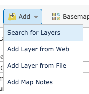

Now the left side panel will have changed to search interface. In the search box, type **London population**. Leave the default of searching **In ArcGIS Online**. *Note:There are more advance options in this field if you have another GIS server from which you want to extract layers.* Leaving the **Within map area** option checked will only show you layers that include at least a portion of your current map view. This can help filter out irrelevant results. Now, click **Go** to see the results. 

A few entries down the list, you should see a layer called **Londons population density for different geographies**. Click the name of the layer to see more information about it. The pop-up that appears shows a preview of the layer, the username of the creator, and a brief textual summary.

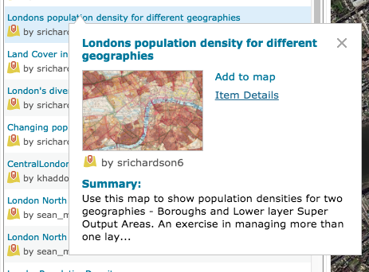

However, before adding the layer, it is to wise to do additional research to make sure it is trustworthy. Select **Item Details** to open a new tab with more information about this data layer. 

At the top, you will the summary, username, and the created/updated date. You can click on the username to get more information about the creator. If you examine the creator, you will learn that he is a Geography teacher in the UK with reputable credentials.

In the description, You learn that that source of this is the London Data Store and the ONS, which stands for the [Office of National Statistics](https://www.ons.gov.uk/). You may also note in the description that the data is not styled. This will give us an opportunity later in the tutorial to learn about styling layers. 

Finally, under **Layers** you may note that two layers are included: Boroughs and LSOAs(lower layer super output areas). 

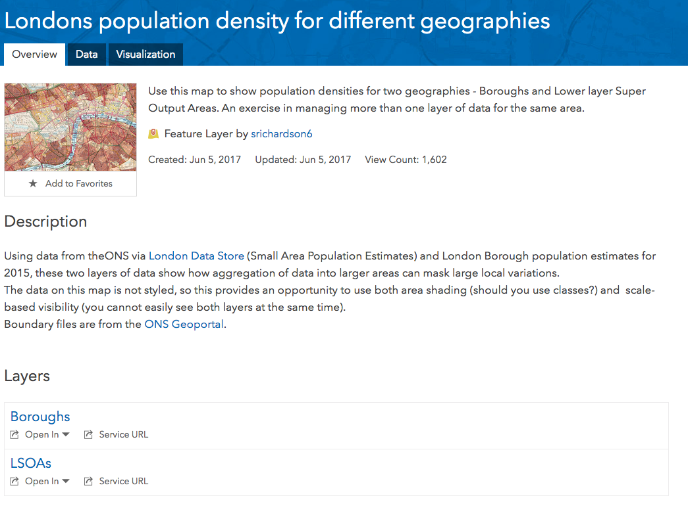

Now that we know more about this layer and feel comfortable about its source, we can go back to the map. Click **Add** next to the data layer to add it to the map.

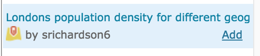 

As soon as you click add, the data layer will populate on your map. Select **Done Adding Layers** to exit the search for layers interface. 

In the side panel, you should now see two new layers -- one for the boroughs and one for the LSOAs. Currently, neither show us much information because they are unstyled. We will come back later in the tutorial to change this, but for now, let's continue adding layers. *Note: You can uncheck the boxes next to the layers to hide them from the map view. You may want to do that to the two unstyled layers temporarily.*

[Return to Top](#about)
### Add Layer from File
ArcGIS Online also allows public users to add small data files. *Note: If you find your file is too large, you can try to break it into smaller files.* ArcGIS online supports file formats common to GIS like Shapefiles, GPX, and GeoJASON. It also accepts plain text files includes CSV and TXT files. The plain text files need to include addresses or coordinate information. 

For this example, we will add a CSV file created with data from the 2011 Census with information about reported religious identities. This data was found by searching the [London DataStore](https://data.london.gov.uk/). The title of the original dataset is ["Population by Religion, Borough"](https://data.london.gov.uk/dataset/percentage-population-religion-borough). This dataset has been cleaned and had coordinates for each borough added. 

**[Download the cleaned dataset](files/2011-religion-by-borough.csv)** and save it somewhere on your computer where you will be able to find it. 

Open the data and examine it to ensure you understand the contents. 

Now, we can add this data to the map. Select **Add** from the top left menu, and click **Add Layer from File.** 

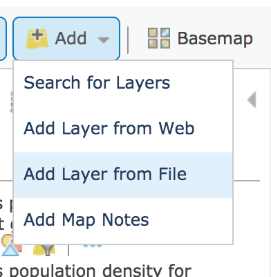

In the window that appears, select **Choose File**, and navigate and select the file you just downloaded. Once you have selected your file, click **IMPORT LAYER** to add it to your map. 

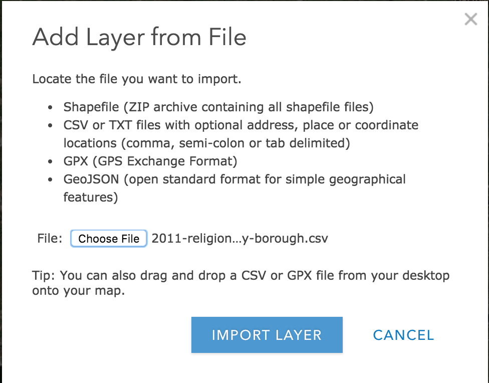

After you import the layer (it may take a few moments depending on the size and complexity of the file), you will see options for selecting an attribute to map and selecting a drawing. For now, just leave the defaults and click **DONE**. We go back and style this further down in the tutorial. 

Now, if you look at the side panel, you should see three layers in addition to your basemap under **Contents**. We are going to manually create one more layer before we style these. If the unstyled layers are distracting. Unselect the checkboxes besides the layer name to remove those from your map view. 

[Return to Top](#about)
### Add Layer Using Map Notes
Now we are going to manually create a new layer in the ArcGIS interface. In this layer we will mark the locations of churches in London. 

To being, select **Add** in the top left and click **Add Map Notes**. 

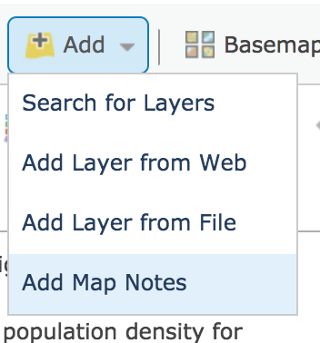

In the dialog box that appears, give your map notes layer a name. In this example, I will call this layer, London churches. I will leave the default Map Notes template. Click **CREATE** to start your layer. 

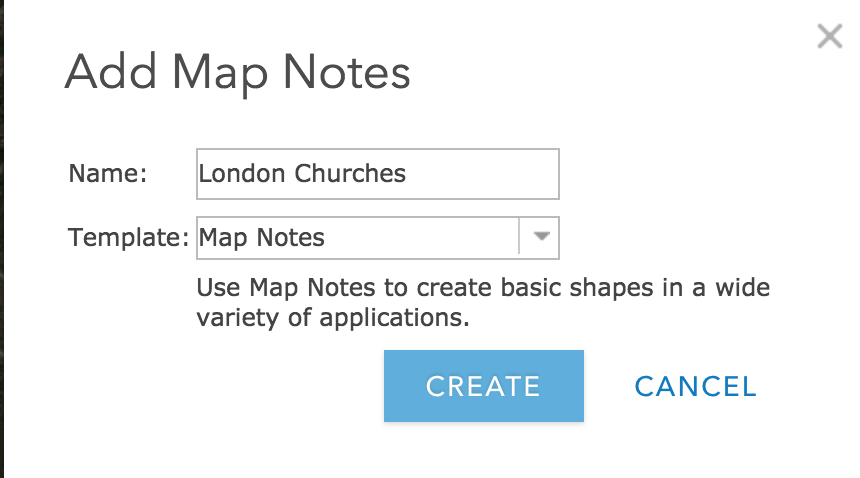

The side panel will have changed from displaying the map's layer to an **Add Features** interface. This interface allows you to select a symbol and the marker. Then you can a point by clicking the desired map location. 

However, we need to find a church to mark on the map first. I'll start by finding St. Paul's Cathedral. Start searching for St. Paul's Cathedral in the search bar on the upper right. Select the London church when is appears in the list. The map will reposition itself over St Paul's Cathedral and a dialog box will open. Click the **down arrow** next to Add to Map Notes and select the layer we just created called **London Churches**.

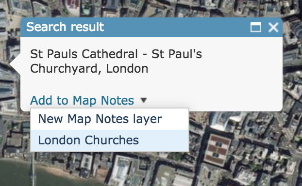

After doing this, you will see a point on your map. Double-click on the point you just add to open a dialog box, where you can add more information about the point. The info you add to this box, will be what appears when users click on this point. When you are finished adding information click **CLOSE**.

Repeat this process to add a few more churches to this layer. 

[Return to Top](#about)
## Saving the Map
Now that we have added several data layers. Let's save our map to avoid losing any of our progress thus far. 

Click **Save** on the top toolbar. A dialog box will open asking for a title, tag, and summary. You must have a title and tag. The summary is optional. Once you have filled out these fields. Select **Save Map**. 

[Return to Top](#about)
## Styling the map
Our map is rich with data but is not very easily interpreted. Let's go back to each of the layer we added to style them meaningfully. 

### Styling Population Density
In the side panel select the two London population density layers. We first need to decide what layer to use. The LSOAs provides more granular data, but since we have religious information by the boroughs, we may want to make this layer consistent with that layer. For this example, let's keep the boroughs data and remove the LSOAs. 

#### Removing layer
We have two options to remove the LSOAs. First, we uncheck it so it does not appear on the map but remains in the list of layers. The second option is to completely remove it. To remove it entirely, hoover over the layer and click the three dots. Then select **Remove**. A dialog box will appear confirming that you want to remove the layer. Click **YES, REMOVE LAYER** to finalize the process. 

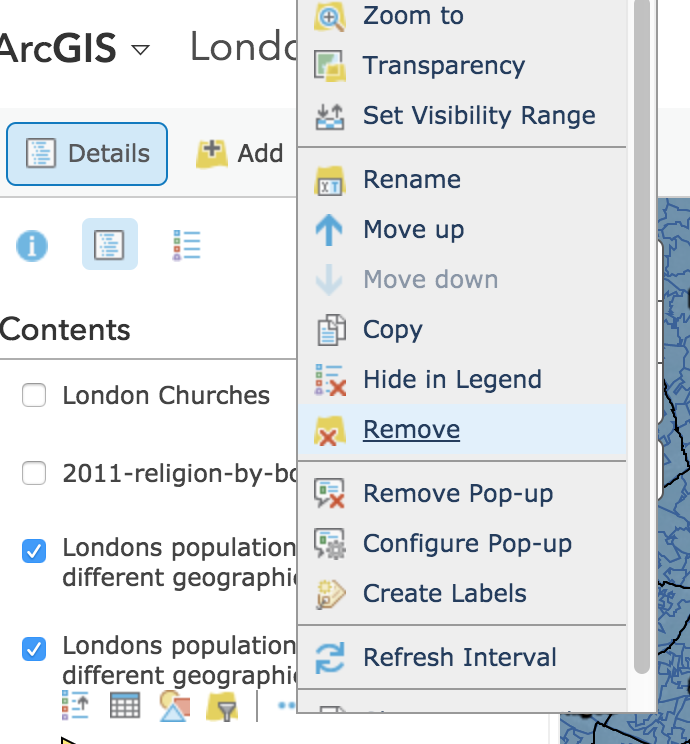

### Change Style
Now, that we only have one population density layer, we can style it. Hoover over the layer name, and select **Change Styles** icon with the different shapes. 

In the side panel, you should now be able to select and attribute. Use the dropdown menu to select **Pop_den**. Based on the data and attributes you are trying to map, ArcGIS will recommend styles. Its recommendations are normally pretty good. Let's use the style it suggests: **Counts and Amounts (Color)**. 

Hoover over the Counts and Amounts and select **Options** to open an interface to customize the style further. Here you can change the color scheme by selecting **Symbols** and use the slider to adjust the divisions among other option. One import option to note is the **Classify Data** checkbox. This will allow you designate distinct categories instead of a sliding scale and allow you to style according. 

Adjust the styling however you would like. Click **OK** when you are done selecting options. Then, select **DONE** to exit the change style window. 

Your map should look similar to the image below although your coloring might be different depending on your styling choices. 

**What observations can you make from the visualization of this data layer?**

**Are there any surprises so far?**

### Other Styling Options
There are few other styling option you can access from the side panels Contents section. Hoover over the layer, and select the three dots icon. 

From this menu, you can change the transparency or visibility range of the layer. You may want to adjust the transparency so other other layers are more visible. You may want to adjust the visibility range to match the specificity of the data. For instance of this data set, you may not want to color of the population density display, when are are closely zoomed into one borough since all of the background would be the same color and not provide much useful information. 

**What is another example where you might want to adjust the visibility range?**

**Explore the other options available when you hoover over the layer's name. What are they and how could they be useful?**

[Return to Top](#about)
### Styling Religion Data
Let's add another dimension to this map by styling our 2011 religion by borough layer. 

### Changing Style
Repeat the steps we did above for this layer. Hoover over the layer and select the **Change Shape** icon. 

In this layer, you have a lot more potential attributes to map that could be meaningful. Let's start by mapping the percentage of the population that reported being Muslim. To do this, select the PercentageMuslim attribute. 

Again, the recommended style, **Counts and Amounts (Size)** is a good fit for our data. Click **Options** to change the symbol choice and size. Notice that this drawing style also has the **Classify Data** checkbox. Click **OK** when you are finished specifying options. 

Before exiting the Change Style interface, look at some of the other drawing styles. Feel free to try some of them out. 

**Why or why not are these drawing styles good fits for the data?** 

### Copying layer 
We may want to have multiple layers from our religion by borough dataset. To do this, we can copy the layer. Hoover over the layer and select the three dots, then click **Copy**.

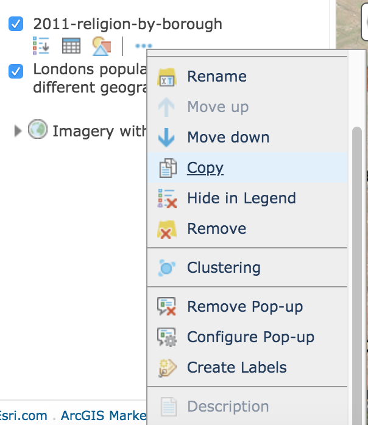

This will create a duplicate layer with the original layer name - Copy. To change the name, click the three dots and then **Rename**. We might want to rename this layer to reflect that we will look at Hindu populations. 

Change the styling of this new layer to show the Hindu population percentage in the London boroughs. 

[Return to Top](#about)
### Styling Churches Layer
Finally, let's go back and edit the churches layer. 

Unfortunately, you will need to edit these point by point. First make sure that you churches layer is turned on in the side panel. Then, zoom to one of your points. Double click the point, and the dialog box to edit it should appear. Click **Change Symbol** to change the shape of the point. You can select one from the list provide or add your own image. Note that you can also change the size using the slider at the bottom of the window. When you are satisfied with your selection, click **OK**. Close the dialog box, and your changes should have been applied. 

### Rearranging and Selecting Layers
As you have noticed, maps can be overwhelmed with information very quickly. 

We can help make our map clearer my rearranging data layers and selecting which ones to be active. 

Let's start by switching the Hindu population and the Muslim population percentages layers. To do this, hoover over the layer name, and point your mouse over the three dots that appear to the left of the layer name. Click and drag to reposition the layer to where you want it on the list. In general, layers closer to top of the list will appear on top of those below it in the list. 

You also may want to deselect layers to make your map clearer. You can leave the deselected layers on your map and allow visitors to turn them off and on. You can also select individual layers for each slide in a Story Map if that is how you choose to present your findings.  
[Return to Top](#about)

## Sharing the Map
Now that we have finished our map, it is time to share it. First, save you map. Then click the **Share** button right next to Save. 

First you will need to make your map public by selecting to **Everyone(public).** 

Then, you will see a link you can send to others, an option to get an embed code, and an option to create a web app. Story Maps, one of these web apps, is a good way to provide rich context to your map. If you are interested in creating a story map, please view our guide on [Story Maps](https://oudsl.github.io/arcgisstorymaps/). 

[Return to Top](#about)
